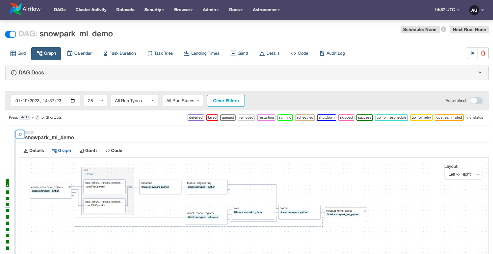

  
## Intro
[Snowpark ML](https://docs.snowflake.com/en/developer-guide/snowpark-ml/index) (in public preview) is a python framework for Machine Learning workloads with [Snowpark](https://docs.snowflake.com/en/developer-guide/snowpark/python/index.html).  Currently Snowpark ML provides a model registry (storing ML tracking data and models in Snowflake tables and stages), feature engineering primitives similar to scikit-learn (ie. LabelEncoder, OneHotEncoder, etc.) and support for training and deploying [certain model types](https://docs.snowflake.com/en/developer-guide/snowpark-ml/snowpark-ml-modeling#snowpark-ml-modeling-classes) as well as deployments as user-defined functions (UDFs).

This guide demonstrates how to use Apache Airflow to orchestrate a machine learning pipeline leveraging Snowpark ML for feature engineering as well as model training and scoring. 

This demo also shows the use of the Snowflake XCOM backend which reinforces security and governance by serializing all task in/output to Snowflake tables and stages while storing in the Airflow XCOM table a URI pointer to the data.
 
## Prerequisites  
  
- Astro [CLI](https://docs.astronomer.io/astro/cli/get-started)
- Docker Desktop
- Git
- Snowflake account (or a [trial account](https://signup.snowflake.com/))
  
## Setup  
  
1. Install Astronomer's [Astro CLI](https://github.com/astronomer/astro-cli).  The Astro CLI is an Apache 2.0 licensed, open-source tool for building Airflow instances and is the fastest and easiest way to be up and running with Airflow in minutes. Open a terminal window and run:

For MacOS  
```bash
brew install astro
```
  
For Linux
```bash
curl -sSL install.astronomer.io | sudo bash -s
```

2. Clone this repository:
```bash
git clone https://github.com/astronomer/airflow-snowparkml-demo
cd airflow-snowparkml-demo
```

3. Open the `.env` file in an editor and update the following variables with you account information
This demo assumes the use of a new Snowflake trial account with admin privileges.  A database named 'DEMO' and schema named 'DEMO' will be created in the DAG.  Running this demo without admin privileges or with existing database/schema will require further updates to the `.env` file.
  
- AIRFLOW_CONN_SNOWFLAKE_DEFAULT  
  -- login  
  -- password  
  -- account **  
  
** The Snowflake `account` field of the connection should use the new `ORG_NAME-ACCOUNT_NAME` format as per [Snowflake Account Identifier policies](https://docs.snowflake.com/en/user-guide/admin-account-identifier).  The ORG and ACCOUNT names can be found in the confirmation email or in the Snowflake login link (ie. `https://xxxxxxx-yyy11111.snowflakecomputing.com/console/login`)
Do not specify a `region` when using this format for accounts.
  
NOTE: Database and Schema names should be CAPITALIZED due to a bug in Snowpark ML.  
  
4.  Start Apache Airflow:
    ```sh
    astro dev start
    ```  

5. Run the Snowpark ML Demo DAG
```bash
astro dev run dags unpause snowpark_ml_demo
astro dev run dags trigger snowpark_ml_demo
```

6. Connect to the Local [Airflow UI](http://localhost:8080/dags/snowpark_ml_demo/grid) and login with **admin/admin**  

7. While waiting for the DAG run to complete exam the DAG code by opening the file `include/dags/snowpark_ml_demo.py`.  Each function includes a docstring with an explanation of the task functions.

For a more advanced example see the [Customer Analytics Demo](./README_CA.md)